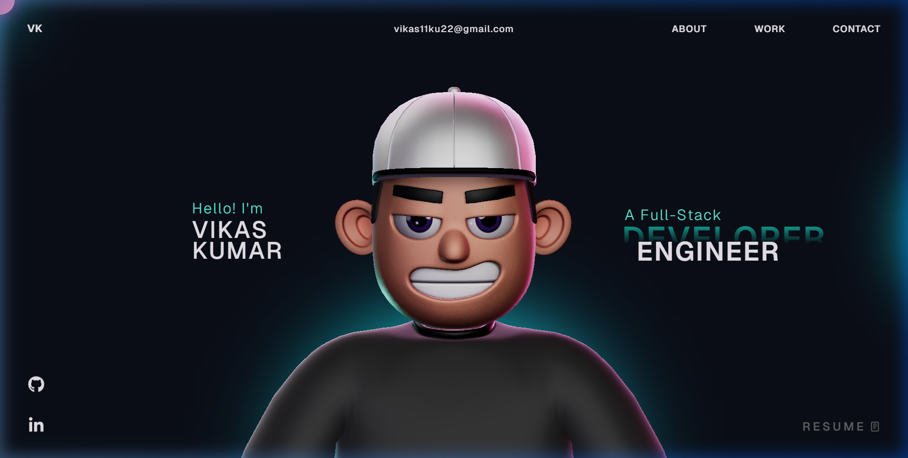

<div align="center">

```
                              ██████╗  ██████╗ ██████╗ ████████╗███████╗ ██████╗ ██╗     ██╗ ██████╗
                              ██╔══██╗██╔═══██╗██╔══██╗╚══██╔══╝██╔════╝██╔═══██╗██║     ██║██╔═══██╗
                              ██████╔╝██║   ██║██████╔╝   ██║   █████╗  ██║   ██║██║     ██║██║   ██║
                              ██╔═══╝ ██║   ██║██╔══██╗   ██║   ██╔══╝  ██║   ██║██║     ██║██║   ██║
                              ██║     ╚██████╔╝██║  ██║   ██║   ██║     ╚██████╔╝███████╗██║╚██████╔╝
                              ╚═╝      ╚═════╝ ╚═╝  ╚═╝   ╚═╝   ╚═╝      ╚═════╝ ╚══════╝╚═╝ ╚═════╝
```

# ✦ Vikas Kumar Portfolio ✦

**A slick, 3D animated portfolio — built with React, GSAP & Three.js**

</div>

---

## ⚡ Portfolio Showcase




## 🛠️ Tech Stack

This portfolio leverages the latest web technologies for a premium feel:

| Technology             | Purpose                              |
| ---------------------- | ------------------------------------ |
| **React + TypeScript** | Core architecture & Type safety      |
| **Vite**               | Blazing fast build & dev environment |
| **GSAP**               | High-performance scrolling & motion  |
| **Three.js + R3F**     | Interactive 3D models & backgrounds |
| **Lenis Scroll**       | Ultra-smooth momentum scrolling      |
| **Vanilla CSS**        | Custom, pixel-perfect styling        |

## ✨ Features

- **Personalized 3D Avatar**: An interactive central character that brings the site to life.
- **Dynamic Headers**: Clean navigation with quick access to About, Work, and Contact sections.
- **Direct Contact**: Integrated email access at `vikas11ku22@gmail.com`.
- **Social Integration**: One-click access to my GitHub and LinkedIn profiles.

## 🚀 Getting Started

To explore or modify this portfolio locally:

### 1. Clone the repository
```bash
git clone https://github.com/Vikaumar/PortFolio.git
cd PortFolio
```

### 2. Install Dependencies
```bash
npm install
```

### 3. Start Development Server
```bash
npm run dev
```

The site will be available at `http://localhost:5173`.

## 📫 Connect with Me

- **Email**: [vikas11ku22@gmail.com](mailto:vikas11ku22@gmail.com)
- **GitHub**: [@Vikaumar](https://github.com/Vikaumar)
- **LinkedIn**: [Vikas Kumar](https://linkedin.com/in/vikaumar)

---

<div align="center">
  
**Crafted with 💖 by Vikas Kumar**

</div>
