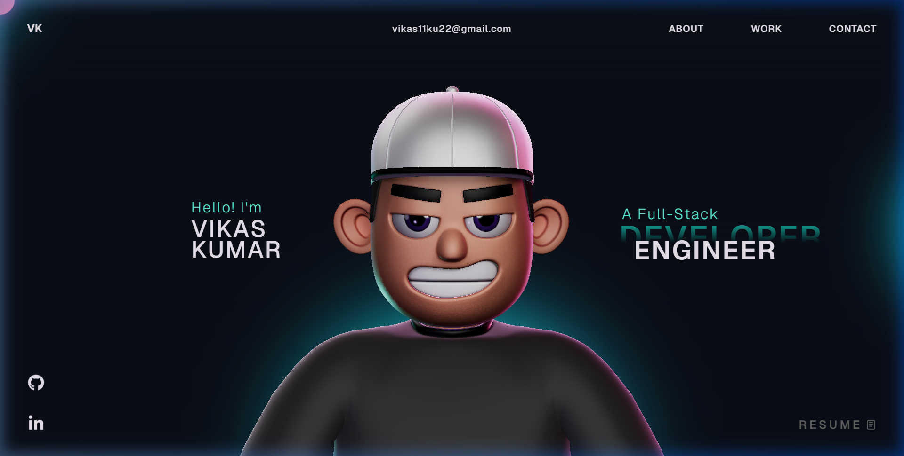

<div align="center">

```
██████╗  ██████╗ ██████╗ ████████╗███████╗ ██████╗ ██╗     ██╗ ██████╗
██╔══██╗██╔═══██╗██╔══██╗╚══██╔══╝██╔════╝██╔═══██╗██║     ██║██╔═══██╗
██████╔╝██║   ██║██████╔╝   ██║   █████╗  ██║   ██║██║     ██║██║   ██║
██╔═══╝ ██║   ██║██╔══██╗   ██║   ██╔══╝  ██║   ██║██║     ██║██║   ██║
██║     ╚██████╔╝██║  ██║   ██║   ██║     ╚██████╔╝███████╗██║╚██████╔╝
╚═╝      ╚═════╝ ╚═╝  ╚═╝   ╚═╝   ╚═╝      ╚═════╝ ╚══════╝╚═╝ ╚═════╝
```

# ✦ Vikas Kumar — Portfolio ✦

**An immersive, 3D-animated developer portfolio built with React, Three.js & GSAP**

[](https://vikas-portfolio-lime.vercel.app/)
[](https://github.com/Vikaumar)
[](https://linkedin.com/in/vikaumar)

</div>

---

## ⚡ Preview



> A cinematic portfolio experience featuring a fully interactive 3D avatar, scroll-driven animations, particle backgrounds, and buttery-smooth navigation — no templates, no shortcuts, built from scratch.

---

## 🏗️ Architecture & Tech Stack

| Layer | Technology | Role |
|---|---|---|
| **Framework** | React 18 + TypeScript | Component architecture & type safety |
| **Build** | Vite 8 | Sub-second HMR & optimized production builds |
| **3D Engine** | Three.js + React Three Fiber + Drei | Interactive 3D character model & scene |
| **Animation** | GSAP + SplitText + ScrollTrigger | Text reveals, scroll-driven motion, & timeline orchestrations |
| **Scrolling** | Lenis | Momentum-based smooth scrolling |
| **Styling** | Vanilla CSS | Hand-crafted, pixel-perfect responsive design |
| **Deployment** | Vercel | CI/CD with automatic GitHub deployments |
| **Analytics** | Vercel Analytics | Privacy-friendly, zero-config visitor tracking |

---

## ✨ Key Features

### 🎭 Interactive 3D Avatar
A custom 3D character model rendered with React Three Fiber sits at the center of the hero section — complete with lighting, post-processing effects, and DRACO-compressed GLB models for fast loading.

### 🔤 Cinematic Text Animations
Every heading and paragraph uses GSAP's **SplitText** plugin for character-level and word-level reveal animations triggered on scroll, with staggered easing for a premium feel.

### 🌌 Particle Background
A custom canvas-based particle system creates depth and atmosphere behind the content, with subtle parallax movement.

### 🧲 Magnetic Buttons
Interactive magnetic hover effects on key call-to-action elements — buttons subtly follow the cursor on hover for a tactile, modern feel.

### 📊 Animated Stats Counter
The About section features animated count-up statistics (projects built, LeetCode problems solved, hackathon wins) that trigger on scroll into view using intersection observers.

### 🎠 Project Carousel
A custom-built carousel showcasing 6 projects (Edura, Delicia, Prescripto, VidhyaSetu, GTA VI Landing, AuthX) with smooth slide transitions, navigation arrows, and dot indicators.

### 📏 Scroll Progress Indicator
A progress bar at the top of the viewport that tracks the user's scroll position through the page.

### 🖱️ Custom Cursor
A bespoke cursor implementation that transforms on interactive element hover, replacing the default system cursor for a cohesive design language.

### 📱 Fully Responsive
Crafted with responsive breakpoints at 1600px, 1300px, and 900px — adapting layout, typography, and interactions gracefully from ultra-wide monitors down to mobile.

---

## 🗂️ Project Structure

```
PortFolio/
├── public/
│   ├── models/              # 3D GLB character models
│   ├── draco/               # DRACO decoder for compressed models
│   ├── images/              # Project screenshots & OG preview
│   ├── ResumeMain.pdf       # Downloadable resume
│   ├── robots.txt           # SEO crawl directives
│   └── sitemap.xml          # XML sitemap
├── src/
│   ├── components/
│   │   ├── Character/       # 3D avatar & R3F scene components
│   │   ├── styles/          # Per-component CSS modules
│   │   ├── utils/           # GSAP helpers (SplitText, ScrollTrigger, initialFX)
│   │   ├── Landing.tsx      # Hero section with 3D model
│   │   ├── About.tsx        # Bio, stats counters
│   │   ├── WhatIDo.tsx      # Skills grid (Frontend / Backend / DevOps)
│   │   ├── Career.tsx       # Experience timeline
│   │   ├── TechStack.tsx    # Tech balls / marquee
│   │   ├── Work.tsx         # Project carousel
│   │   ├── Contact.tsx      # Contact info & social links
│   │   ├── Navbar.tsx       # Navigation + Lenis smooth scroll
│   │   ├── Loading.tsx      # Loading screen with progress
│   │   ├── ParticleBackground.tsx  # Canvas particle system
│   │   ├── MagneticButton.tsx      # Magnetic hover effect
│   │   ├── ScrollProgress.tsx      # Top scroll progress bar
│   │   └── Cursor.tsx              # Custom cursor
│   ├── App.tsx              # Root component
│   └── main.tsx             # Entry point
├── index.html               # HTML shell with SEO meta tags
├── package.json
├── tsconfig.json
└── vite.config.ts
```

---

## 🚀 Getting Started

### Prerequisites
- **Node.js** ≥ 18
- **npm** ≥ 9

### 1. Clone the repository
```bash
git clone https://github.com/Vikaumar/PortFolio.git
cd PortFolio
```

### 2. Install dependencies
```bash
npm install
```

### 3. Start the development server
```bash
npm run dev
```

The site will be available at `http://localhost:5173`.

### 4. Build for production
```bash
npm run build
```

The optimized output will be in the `dist/` directory, ready for deployment.

---

## 🌐 Deployment

This site is deployed on **Vercel** with automatic CI/CD:

1. Every `git push` to `main` triggers an automatic build & deploy.
2. Preview deployments are created for pull requests.
3. The production domain is: **[vikas-portfolio-lime.vercel.app](https://vikas-portfolio-lime.vercel.app/)**

---

## 📦 Featured Projects

| # | Project | Description | Stack |
|---|---------|-------------|-------|
| 01 | **Edura** | Gamified learning platform | Spring Boot, HTML/CSS/JS, Gemini API |
| 02 | **Delicia** | Food delivery platform | React, Node.js/Express, MongoDB |
| 03 | **Prescripto** | Full-stack medical web app | React, Node.js |
| 04 | **VidhyaSetu** | AI-powered smart education platform | MERN, OpenAI, Python, JWT |
| 05 | **GTA VI Landing** | Cinematic frontend clone | JavaScript, HTML, CSS, GSAP |
| 06 | **AuthX** | Secure authentication system | Node.js, JWT, PostgreSQL, Redis |

---

## 📫 Connect

- **Email**: [vikas11ku22@gmail.com](mailto:vikas11ku22@gmail.com)
- **GitHub**: [@Vikaumar](https://github.com/Vikaumar)
- **LinkedIn**: [Vikas Kumar](https://linkedin.com/in/vikaumar)
- **Portfolio**: [vikas-portfolio-lime.vercel.app](https://vikas-portfolio-lime.vercel.app/)

---

<div align="center">

**Designed & built from scratch by Vikas Kumar** ⚡

</div>
